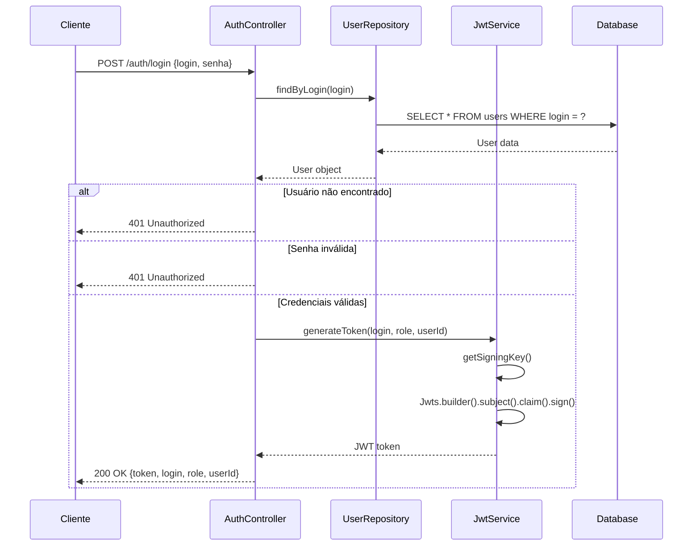
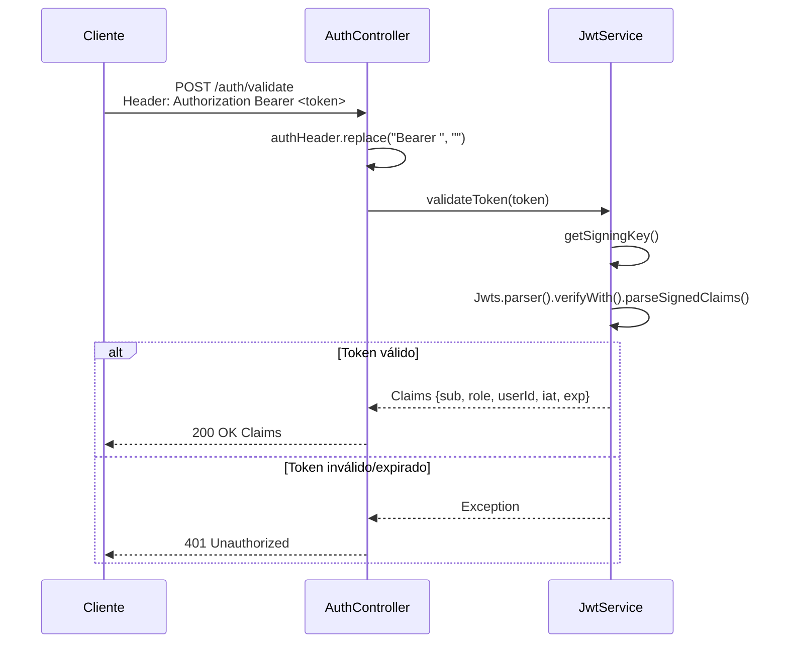
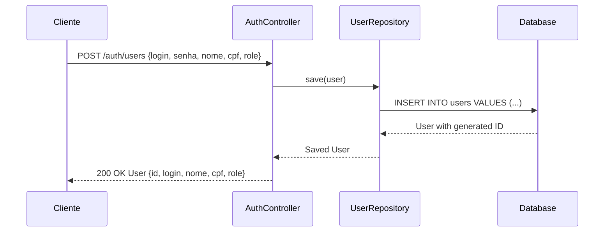
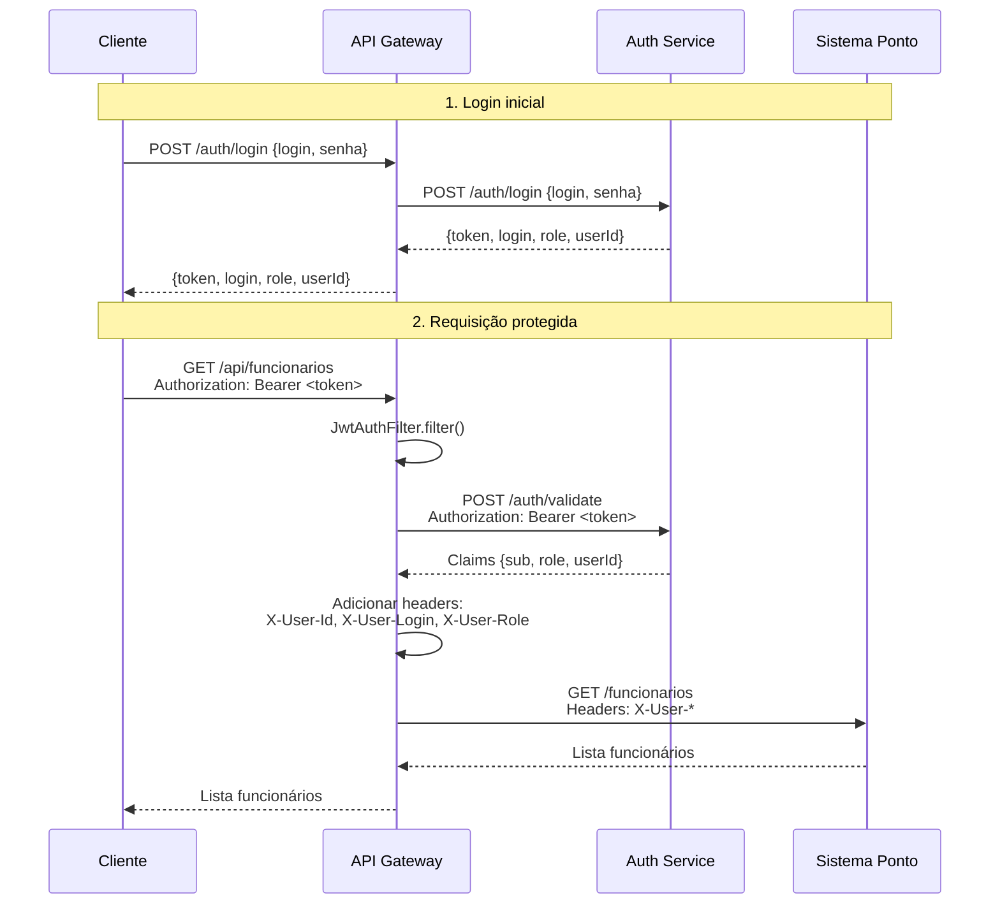
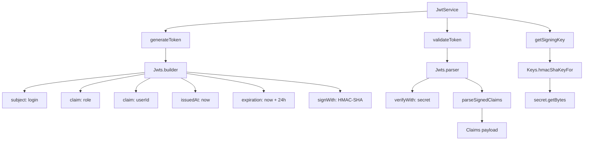

# Diagrama de Sequência - Auth Service

## 🔐 Fluxo de Login

## ✅ Fluxo de Validação de Token

## 👤 Fluxo de Criação de Usuário

## 🏗️ Fluxo Completo via API Gateway

## 🔑 Componentes JWT

## 📊 Estados de Resposta

| Endpoint | Sucesso | Erro |
|----------|---------|------|
| `/auth/login` | 200 + AuthResponse | 401 Unauthorized |
| `/auth/validate` | 200 + Claims | 401 Unauthorized |
| `/auth/users` | 200 + User | 500 Internal Error |

## 🔄 Ciclo de Vida do Token

1. **Geração**: Login válido → JWT criado com 24h de validade
2. **Uso**: Token enviado em requests protegidos via header
3. **Validação**: Gateway valida token antes de rotear
4. **Expiração**: Token expira após 24h, necessário novo login